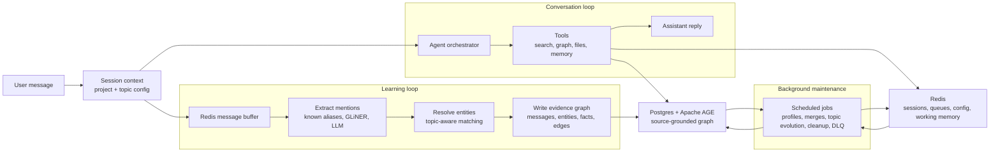

# Knoggin

Knoggin is a self-hosted memory engine for AI agents and personal tools. It turns conversations, files, and observations into a source-grounded knowledge graph — entities, relationships, and facts — that agents can query without losing the trail back to original evidence.

You bring a topic configuration that reflects your domain: the entity types that matter, the aliases people use, the relationships worth tracking, and how strict matching should be. Knoggin uses that configuration to decide what to extract, how to classify it, and when to exercise caution. Think of it less as "the model figures everything out" and more as a tunable library index over evidence.

> Knoggin is an active personal project and still early. The core is being built and tested, and the design will keep changing as I learn what holds up in real use.

## Features

- **Source-grounded memory** — extracted knowledge is an index over evidence, not unquestionable truth. Every fact traces back to the message or file that produced it.
- **Project-scoped** — memory, sessions, entities, and jobs are all scoped to a project boundary.
- **Domain-shaped extraction** — topic configuration controls entity labels, aliases, hierarchy rules, active topics, and matching thresholds.
- **Hybrid NER pipeline** — combines known-alias matching, GLiNER, and LLM extraction with confidence filtering and deduplication.
- **Graph-guided retrieval** — the knowledge graph helps find related context instead of treating every memory as an isolated chunk.
- **Background maintenance** — scheduled jobs handle profile refinement, entity merges, duplicate detection, dead-letter replay, and cleanup.
- **Contradiction detection** — new facts are checked against existing facts using embedding similarity, NLI classification, and LLM judgment.
- **Agent tool suite** — tools for graph queries, memory search, entity lookup, document focus, web search, and topic management.

## Topic Configuration

Knoggin is not a universal ontology generator. It works best when the user provides a topic configuration that reflects the domain. A useful config tells the system:

- Which entity types matter (people, tools, concepts, etc.)
- Which names or aliases should resolve to the same entity
- Which relationships are worth tracking
- Which topics are currently active
- How strict or forgiving entity matching should be
- When hierarchy matters (e.g. project → milestone → task)

These constraints keep the graph closer to a usable index than a pile of generated guesses.

## Architecture

The engine runs as two loops that share the same project memory:

- The **conversation loop** answers the user by reading from tools, memory, files, and the graph.
- The **learning loop** runs behind the scenes, turning new messages into entities, relationships, facts, and background work.

Both loops are shaped by the project's topic configuration.



The main runtime object is `ProjectState`, which holds the topic config, entity resolver, text pipeline, and job scheduler for a project. Active sessions get a `Session` context that points into that project state, so the agent and ingestion pipeline operate against the same view of memory.

## Project Structure

```
server/src/
  common/           Shared schemas, config, scoping, utilities
  core/
    agent/          Agent orchestrator, executor, reasoning loop, tool suite
    ingestion/      NER pipeline, batch consumer, DLQ, profile jobs
    knowledge/      Entity resolution, fact resolution, graph readers/writers,
                    embeddings, merge service, document service
    project/        ProjectState, ProjectManager
    session/        Session context, lifecycle, onboarding
    community/      Cross-project entity sharing
  infrastructure/   Postgres, Redis, LLM client, knowledge store, job scheduler
```

## Development Note

I use AI tools while building Knoggin, mostly for coding help and review passes. The project direction, tradeoffs, and final calls are mine.

## License

[AGPL-3.0](./LICENSE)

## Contact

Feedback is welcome: adedewe.a@northeastern.edu
