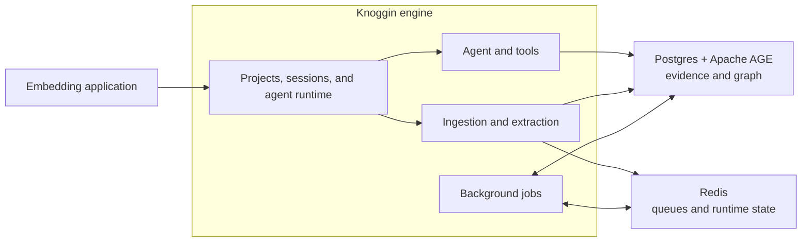

# Knoggin

Knoggin is a self-hosted, source-grounded memory engine for AI agents and personal tools. It turns conversations and files into a project-scoped knowledge graph of entities, relationships, facts, and evidence—so an agent can retrieve useful context without losing the path back to the original source.

It is designed around a domain configuration supplied per project. Rather than inferring a universal ontology, Knoggin uses the entity types, aliases, relationships, topics, and matching rules that matter in your domain.

> Knoggin is an early personal project. The engine runtime is under active development and may change.

## What it does

- Keeps memory **source-grounded**: facts and graph records retain links to the messages or documents that produced them.
- Separates data by **project**: projects, sessions, documents, entities, jobs, and memory are scoped together.
- Extracts and resolves entities with known aliases, GLiNER, optional LLM extraction, confidence filtering, and deduplication.
- Uses graph-aware and hybrid retrieval to give agents related context, not just isolated chunks.
- Ingests documents and supports focused retrieval over a selected document, folder upload, or subtree.
- Runs background maintenance for episodic memory, profiles, merges, duplicate detection, dead-letter replay, and retention.
- Checks potential contradictions with embedding similarity, NLI, and LLM judgment.

## Architecture



The engine lives in `server/` and intentionally does not prescribe an HTTP transport. An embedding application owns its own integration surface while Knoggin owns the durable memory, retrieval, and background processing runtime.

## Quick start

### Prerequisites

- Python 3.12+
- [uv](https://docs.astral.sh/uv/)
- Docker and Docker Compose

From the repository root, create local configuration and start the storage services:

```powershell
Copy-Item .env.example .env
docker compose up -d
uv sync --package server
```

The first engine start downloads the embedding, reranking, NLI, spaCy, and GLiNER models. To download those before integrating the engine, run:

```powershell
./setup.sh --prefetch-models
```

On Windows, run `setup.sh` from Git Bash, WSL, or another Bash-compatible shell. Copying `.env.example` directly is sufficient for local Docker defaults.

Stop the storage services when finished:

```powershell
docker compose down
```

This preserves the named Postgres volume. Use `docker compose down -v` only when you intend to remove local database data.

## Configuration

`.env.example` documents local runtime settings, including the database URL, model choices, resource profile, and document storage directory. Docker Compose starts Redis and a Postgres image configured with Apache AGE, pgvector, and the project schema.

Knoggin writes application-level settings to `config/knoggin.yml`. This file is managed by the app; manual changes can be overwritten. The topic seed lives at `server/src/common/templates/topics.yaml`.

For more predictable startup performance, set `KNOGGIN_RESOURCE_PROFILE` to `conservative`, `balanced` (default), or `performance`. Set `KNOGGIN_GPU=true` when a supported accelerator and matching runtime are available.

## Development

Run the server test suite:

```powershell
uv run --package server pytest server/tests
```

Lint the engine:

```powershell
uv run ruff check server/src server/tests
```

## Repository layout

```text
server/src/common/      Shared schemas, configuration, and utilities
server/src/core/agent/  Agent orchestration, prompting, execution, and tools
server/src/core/project/  Project state, domain config, and workspace services
server/src/core/session/  Session lifecycle and runtime context
server/src/core/ingestion/  Extraction, batching, episodes, and dead-letter work
server/src/core/knowledge/  Entity resolution, documents, graph, and retrieval
server/src/infrastructure/  Postgres, Redis, models, queues, and scheduling
server/tests/            Unit, runtime, ingestion, storage, and integration tests
docker/                 Local Postgres image and initialization
```

## License

[AGPL-3.0](./LICENSE)

## Contact

Feedback is welcome at adedewe.a@northeastern.edu.
