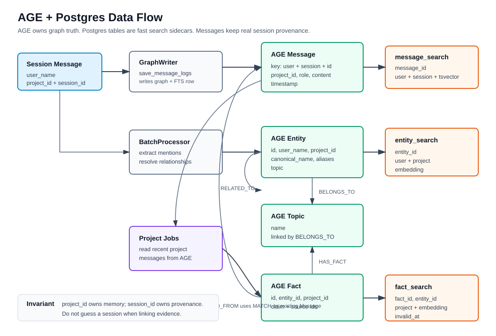

# AGE + Postgres Data Flow

This system uses Apache AGE for the durable knowledge graph and regular Postgres
tables as search sidecars. AGE owns the domain relationships. Postgres helper
tables make text and vector lookup fast, then readers hydrate details back from
the graph when needed.

## Scope Rule

- `project_id` owns project memory: entities, facts, relationships, topics,
  profile state, and topic state.
- `session_id` owns message provenance: each message came from one real session.
- A project can contain many sessions. Code should never use `project_id` as a
  fake `session_id`.

## Data Model

## Main Objects

- `Message` nodes are the source record for conversation turns. Their identity
  is `(user_name, session_id, id)`, and they also carry `project_id` so project
  jobs can read across multiple sessions.
- `Entity` nodes represent remembered things: people, projects, tools, concepts,
  files, or other named objects. They are project-scoped.
- `Topic` nodes group entities. `Entity-[:BELONGS_TO]->Topic` is descriptive
  metadata, not message provenance.
- `Fact` nodes are atomic claims about an entity. Facts are project-scoped, but
  their evidence should point back to a real source message session.
- Relationship edges such as `RELATED_TO`, `PART_OF`, `BELONGS_TO`, `HAS_FACT`,
  and `EXTRACTED_FROM` describe how graph objects connect.

## Helper Tables

- `entity_search` mirrors entity id, name, user, project, and embedding for
  vector candidate search.
- `message_search` mirrors message id, user, session, and full-text content for
  message search.
- `fact_search` mirrors fact id, entity id, user, project, embedding, and
  invalidation state for fact retrieval.

These tables are not separate sources of truth. They are indexes over AGE-owned
knowledge and must stay synchronized with graph writes.

## Write Flow

1. Session messages enter Redis buffers with both `project_id` and real
   `session_id`.
2. `GraphWriter.save_message_logs` writes `Message` nodes to AGE and matching
   rows to `message_search`.
3. `BatchProcessor` extracts entities and relationships from the batch.
4. `EntityWriter.write_batch` writes entities, topics, and relationships to AGE,
   then updates `entity_search`.
5. Project jobs read recent project messages from AGE. The returned records keep
   each message's real `session_id`.
6. `FactResolutionUtils` maps cited `source_msg_id` values to their real source
   session before facts are written.
7. `FactWriter.create_facts_batch` writes facts to AGE, updates `fact_search`,
   and links facts to existing messages with `MATCH`. It does not create missing
   messages as evidence.

## Sync Invariants

- Any writer that creates or updates searchable graph data must update the
  matching helper table in the same write path.
- Reads may use Postgres helper tables to find candidates, but AGE remains the
  authority for graph shape and relationships.
- Message evidence must use `(source_user_name, source_session_id,
  source_msg_id)`. If the real session is unknown, do not guess.
- Session cleanup should remove session-owned data only. Project-owned profile,
  topic, entity, relationship, and fact state belongs to `project_id`.

## Code Ownership

- Message graph/search writes: `src/knoggin_server/knowledge/db/writers/graph_writer.py`
- Entity, topic, and relationship writes: `src/knoggin_server/knowledge/db/writers/entity_writer.py`
- Fact writes and evidence links: `src/knoggin_server/knowledge/db/writers/fact_writer.py`
- Graph facade: `src/infrastructure/graph_client.py`
- Reader/search helpers: `src/knoggin_server/knowledge/db/readers/`
- Relational helper schema: `src/infrastructure/schema.sql`
