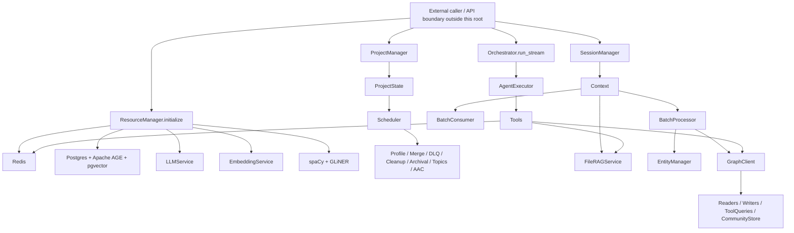
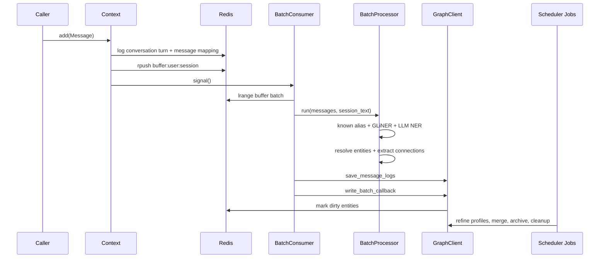
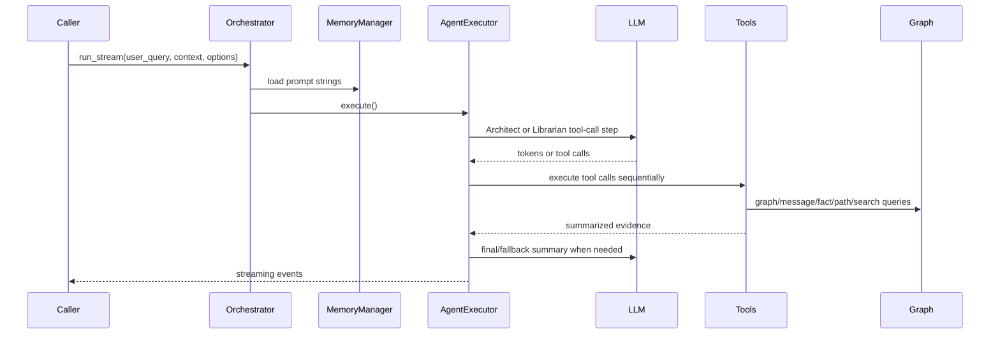
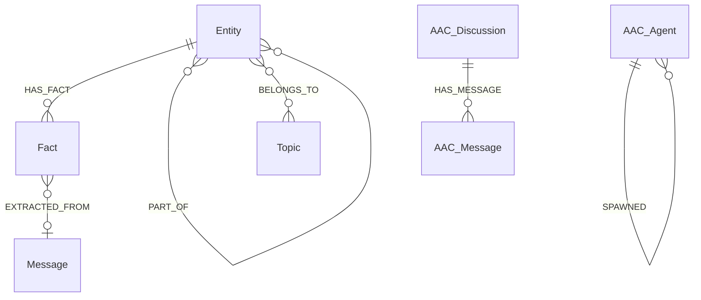

# Knoggin Server Codebase Knowledge

Note: this document is AI-generated and should be treated as a navigational index, not a substitute for verifying behavior against the code.

Target root: `knoggin-server`  
Generated for: future LLM agents implementing features, fixing bugs, and refactoring safely  
Scope rule used: only files under `knoggin-server` were read or analyzed.

## Current State Update

This document was originally generated as a broad codebase map. Recent stabilization work changed several important truths:

- Storage has been hardened around `PostgresClient`, Apache AGE writers/readers, pgvector string bindings, and graph mutation contracts. The `tests/storage/` suite is currently a core regression boundary.
- Runtime assembly has focused fake-backed coverage for `SessionAssembler` and `ProjectManager.get_or_start_project`.
- Wall-clock time is centralized in `src/common/utils/time_utils.py`; production code should use `get_now()`, `get_now_iso()`, `get_now_ms()`, or `get_now_unix()` instead of direct `datetime.now(...)` / `time.time()`.
- `tests/session/` does not exist; session/runtime coverage currently lives under `tests/runtime/` and `tests/unit/session/`.
- Project-scoped background jobs now use `Scheduler.scope_id` / `JobContext.scope_id` for scheduler scope. `session_id` remains as a compatibility alias in the scheduler context, but new job code should prefer `scope_id`.

## 1. High-Level Overview

### What This Application Is

`knoggin-server` is a Python 3.12 server engine for a self-hosted personal AI memory system. Its stated package description is "A transparent, self-hosted knowledge graph for personal AI memory - Server Engine" in `pyproject.toml`. The codebase does not currently expose a FastAPI app, route module, or HTTP entry point inside this root, even though `fastapi[standard]` and `uvicorn` config are present in `pyproject.toml`. The runtime surface is a set of embeddable Python services for:

- creating user sessions,
- collecting conversation messages,
- extracting entities and relationships from messages,
- writing graph and vector-search records into Postgres with Apache AGE and pgvector,
- refining entity profiles into atomic facts,
- retrieving memory through agent tools,
- running configurable AI agents,
- managing uploaded files for session-scoped RAG,
- optionally running autonomous agent community discussions.

Primary evidence:

- `pyproject.toml` defines package `knoggin-server`, Python `>=3.12`, and dependencies including Redis, Postgres, OpenAI/OpenRouter, sentence-transformers, GLiNER, spaCy, LlamaIndex, pgvector, MCP, and search libraries.
- `src/infrastructure/resources.py` defines `ResourceManager`, the singleton that initializes Redis, Postgres/graph storage, LLM service, embeddings, GLiNER, and spaCy.
- `src/knoggin_server/session/session_manager.py` defines `SessionManager`, the session lifecycle API.
- `src/knoggin_server/project/project_manager.py` defines `ProjectManager`, project lifecycle and background job registration.
- `src/knoggin_server/agent/orchestrator.py` defines `Orchestrator.run_stream`, the agent execution entry point.

### Target Users And Business Purpose

The target user is someone running a private, memory-backed AI assistant. The system converts conversational history into a queryable knowledge graph so an agent can later answer questions about people, projects, tasks, preferences, files, and relationships.

Business purposes by feature:

- Session lifecycle: gives each conversation a durable Redis metadata record, isolated message buffer, conversation history, and session-scoped file RAG workspace. See `src/knoggin_server/session/session_manager.py`.
- Project lifecycle: groups sessions under project scopes, supports cross-project readable scopes, and hosts shared project-level runtime state. See `src/knoggin_server/project/project_manager.py`.
- Message ingestion: turns raw user messages into persisted `Message` graph nodes, search rows, entity nodes, relationship edges, and dirty queues for later refinement. See `src/knoggin_server/session/context.py`, `src/knoggin_server/ingestion/services/batch_consumer.py`, and `src/knoggin_server/ingestion/services/pipeline_service.py`.
- Knowledge graph: stores entities, relationships, facts, messages, preferences, topics, hierarchy edges, and AAC discussion nodes in Apache AGE, with pgvector/FTS helper tables. See `src/infrastructure/schema.sql`, `src/infrastructure/graph_client.py`, and `src/knoggin_server/knowledge/db/*`.
- Profile/fact refinement: converts recently touched entities and conversation windows into stable facts, invalidates contradicted facts, and updates embeddings. See `src/knoggin_server/knowledge/jobs/profile_job.py` and `src/knoggin_server/knowledge/services/fact_resolution.py`.
- Merge detection: finds duplicate entities and hierarchy candidates, using fuzzy/vector candidates plus LLM judgment. See `src/knoggin_server/knowledge/jobs/merge_job.py`.
- Agent execution: answers user queries using a bounded multi-step tool loop over graph, messages, files, web search, and memory. See `src/knoggin_server/agent/executor.py`, `src/knoggin_server/agent/tools/registry.py`, and `src/common/schema/tool_schema.py`.
- Agent management: persists configurable agents in Redis and seeds default agent `STELLA`. See `src/knoggin_server/agent/services/agent_manager.py`.
- Memory: provides topic-scoped session memory and agent working memory categories `rules`, `preferences`, and `icks`. See `src/knoggin_server/knowledge/services/memory_service.py`.
- File RAG: ingests uploaded files into session-scoped pgvector tables and searches with vector, BM25, and reranking. See `src/knoggin_server/knowledge/services/file_rag.py`.
- Autonomous Agent Community (AAC): optionally starts multi-agent discussions that can save insights and spawn specialists. See `src/knoggin_server/community/community_manager.py`, `src/knoggin_server/community/community_job.py`, and `src/knoggin_server/agent/tools/community_tools.py`.

### Main Feature Interaction Summary

1. `SessionManager.create_session` acquires a `ProjectState` from `ProjectManager`, builds a `Context`, stores session metadata in Redis, and tracks the active session.
2. `Context.add` persists a user turn in Redis, writes message-id mappings, pushes the message to the Redis ingestion buffer, records project activity, and signals `BatchConsumer`.
3. `BatchConsumer` drains buffered messages, obtains conversation context, calls `BatchProcessor.run`, persists message logs through `GraphClient.save_message_logs`, writes entities/relationships through `write_batch_callback`, and dead-letters failed batches.
4. `BatchProcessor` runs known-alias matching, GLiNER, optional LLM NER, deterministic entity resolution, graph-boosted candidate scoring, message embedding, and LLM connection extraction.
5. Graph writes mark dirty entities in Redis. The project scheduler later runs profile refinement, merge detection, topic evolution, DLQ replay, cleanup, archival, and optionally AAC.
6. `Orchestrator.run_stream` builds tools and prompt memory from the active `Context`, then delegates a reasoning loop to `AgentExecutor`.
7. Agent tools query the graph, raw messages, files, web, or memory and accumulate evidence for final responses.

### Phase 1 State Block

```text
INDEX_VERSION: phase-1
FILE_MAP_SUMMARY: Python package under src/ with common schemas/utils, infrastructure clients/jobs, knoggin_server session/project/ingestion/knowledge/agent/community modules, and tests grouped by runtime, ingestion, storage, knowledge, agent, integration, smoke.
OPEN_QUESTIONS: No HTTP/FastAPI entry point exists inside target root despite FastAPI dependency. It may be outside scope or not yet implemented.
KNOWN_RISKS: The package is an engine/library in this root; callers must wire API boundaries externally.
GLOSSARY_DELTA: Context, ProjectState, BatchProcessor, BatchConsumer, EntityManager, GraphClient, AAC.
```

## 2. File Index And Prioritization

Generated from in-scope files only. `__pycache__`, `.pytest_cache`, `.ruff_cache`, and package metadata were ignored for analysis.

| Priority |                                                         Path | Type          |   Lines | HASH8    | Notes                                                     |
| -------- | -----------------------------------------------------------: | ------------- | ------: | -------- | --------------------------------------------------------- |
| P0       |                                             `pyproject.toml` | config        |      87 | d1172bdb | Package identity and dependencies                         |
| P0       |                            `src/infrastructure/resources.py` | runtime       |     148 | dc08c375 | Global resource singleton                                 |
| P0       |              `src/knoggin_server/session/session_manager.py` | runtime       |     238 | cac8d0c8 | Session CRUD/resume/delete                                |
| P0       |                      `src/knoggin_server/session/context.py` | runtime       |     422 | 91aa1d19 | Active session state, add message, history                |
| P0       |                         `src/knoggin_server/session/boot.py` | runtime       |     167 | d4b56e4a | Session assembly and launch                               |
| P0       |              `src/knoggin_server/project/project_manager.py` | runtime       |     426 | 151eafb3 | Project runtime and job registration                      |
| P0       |                        `src/knoggin_server/project/state.py` | runtime       |      55 | c61d7d32 | Project-level shared state                                |
| P0       |                         `src/infrastructure/redis_client.py` | infra         |     331 | 37793b9c | Redis singleton and key taxonomy                          |
| P0       |                      `src/infrastructure/postgres_client.py` | infra         |     117 | b04a3702 | AGE/pgvector pool wrapper                                 |
| P0       |                         `src/infrastructure/graph_client.py` | infra         |     363 | c4635338 | Storage facade                                            |
| P0       |                              `src/infrastructure/schema.sql` | db schema     |      56 | 8dd1ff31 | pgvector and FTS tables                                   |
| P0       |    `src/knoggin_server/ingestion/services/batch_consumer.py` | ingestion     |     335 | e05f9377 | Redis buffer draining and DLQ                             |
| P0       |  `src/knoggin_server/ingestion/services/pipeline_service.py` | ingestion     |     800 | e8b027da | Batch extraction and resolution                           |
| P0       |         `src/knoggin_server/ingestion/services/processor.py` | ingestion     |     447 | 7b01be5e | NER pipeline                                              |
| P0       |    `src/knoggin_server/knowledge/services/entity_service.py` | knowledge     |     546 | 0a34354d | Entity cache/resolution/merge candidate detection         |
| P0       |          `src/knoggin_server/knowledge/db/write_graph_db.py` | persistence   |     374 | 3f83786f | Typed graph mutation plan                                 |
| P0       |                   `src/knoggin_server/agent/orchestrator.py` | agent         |     200 | 13dd32b0 | Agent entry point                                         |
| P0       |                       `src/knoggin_server/agent/executor.py` | agent         |     509 | 646a194e | Agent reasoning loop                                      |
| P1       |                             `src/common/schema/contracts.py` | schema        |     525 | bb7af001 | Engine handoff models                                     |
| P1       |                            `src/common/schema/primitives.py` | schema        |     149 | f24ab578 | Entity, Connection, Fact, Message                         |
| P1       |                              `src/common/schema/settings.py` | config schema |     215 | 74aebb3f | RootConfig and settings                                   |
| P1       |                                 `src/common/conf/manager.py` | config        |     171 | 5a34d336 | YAML config and subscriptions                             |
| P1       |                           `src/common/conf/topics_config.py` | config        |     213 | 3e81e5de | Topic config helpers                                      |
| P1       |                             `src/common/utils/time_utils.py` | time          | current | current  | Central UTC wall-clock delegates and test clock           |
| P1       |                        `src/infrastructure/job/scheduler.py` | jobs          |     200 | a7ad5e79 | Project job monitor                                       |
| P1       |                           `src/infrastructure/llm_client.py` | infra         |     411 | f333068a | OpenAI/OpenRouter service                                 |
| P1       | `src/knoggin_server/knowledge/services/embedding_service.py` | ML            |     134 | 60c0eaa8 | SentenceTransformer and reranker                          |
| P1       |    `src/knoggin_server/knowledge/services/memory_service.py` | memory        |     374 | 68062df0 | Session and working memory                                |
| P1       |          `src/knoggin_server/knowledge/services/file_rag.py` | RAG           |     350 | a5dbce4b | File ingestion/search                                     |
| P1       |           `src/knoggin_server/knowledge/jobs/profile_job.py` | jobs          |     714 | 9264dbf0 | Fact/profile refinement                                   |
| P1       |             `src/knoggin_server/knowledge/jobs/merge_job.py` | jobs          |     630 | 9c21ab40 | Merge/hierarchy detection                                 |
| P1       |            `src/knoggin_server/knowledge/jobs/topics_job.py` | jobs          |     219 | 542cc3d0 | Topic evolution                                           |
| P1       |               `src/knoggin_server/ingestion/jobs/dlq_job.py` | jobs          |     458 | c0c772c5 | Dead-letter replay                                        |
| P1       |           `src/knoggin_server/ingestion/jobs/cleaner_job.py` | jobs          |     135 | 8137c5ac | Orphan cleanup                                            |
| P1       |           `src/knoggin_server/ingestion/jobs/archive_job.py` | jobs          |      94 | e9431871 | Invalidated fact archival                                 |
| P1       |                 `src/knoggin_server/agent/tools/registry.py` | agent tools   |      66 | 6714c5bc | Tool composition and dispatch map                         |
| P1       |                   `src/knoggin_server/agent/tools/search.py` | agent tools   |     792 | 5491bfbb | Message/entity/file/web search                            |
| P1       |                    `src/knoggin_server/agent/tools/graph.py` | agent tools   |     298 | 6c3fa24b | Graph tools                                               |
| P1       |                           `src/common/schema/tool_schema.py` | agent tools   |     349 | 40518db8 | Tool schemas sent to LLM                                  |
| P1       |         `src/knoggin_server/agent/services/agent_manager.py` | agent         |     170 | 77d99968 | Agent CRUD/defaults                                       |
| P1       |          `src/knoggin_server/community/community_manager.py` | AAC           |     554 | 192a0142 | Autonomous discussions                                    |
| P1       |            `src/knoggin_server/community/community_store.py` | AAC storage   |     279 | 7b7685c7 | AAC AGE nodes                                             |
| P2       |                    `tests/runtime/test_session_lifecycle.py` | tests         |     154 | 31ccdc10 | Session contract                                          |
| P2       |                    `tests/runtime/test_session_assembler.py` | tests         | current | current  | SessionAssembler boot and launch wiring                   |
| P2       |                   `tests/runtime/test_project_membership.py` | tests         | current | current  | Project membership and fake-backed project boot contracts |
| P2       |                 `tests/integration/test_fake_engine_flow.py` | tests         |     142 | 662afd3b | Fake end-to-end lifecycle                                 |
| P2       |                     `tests/ingestion/test_batch_consumer.py` | tests         |     117 | 42405f72 | Buffer/DLQ behavior                                       |
| P2       |               `tests/storage/test_entity_writer_contract.py` | tests         |     240 | 6d3e77e5 | Persistence contract                                      |
| P2       |                 `tests/storage/test_fact_writer_contract.py` | tests         |     218 | 93146c20 | Fact persistence contract                                 |
| P2       |                           `tests/knowledge/test_file_rag.py` | tests         |     174 | fc10ecd8 | File RAG contract                                         |
| P2       |                           `tests/agent/test_orchestrator.py` | tests         |     151 | 8edcacd1 | Agent orchestration contract                              |
| P2       |                       `tests/unit/common/test_time_utils.py` | tests         | current | current  | Central clock and frozen-time default-factory contracts   |

## 3. System Architecture Deep Dive

### Runtime Component Map



### Data Flow: User Message To Knowledge Graph



Implementation anchors:

- `Context.add` assigns deterministic dedup keys, persists user turns, enqueues message JSON, records activity, signals the consumer, and refreshes TTLs in `src/knoggin_server/session/context.py`.
- `BatchConsumer._drain_buffer` validates Redis buffer items, builds session text, calls `BatchProcessor.run`, saves messages, writes graph mutations, handles checkpoints, and enqueues DLQ entries on failures in `src/knoggin_server/ingestion/services/batch_consumer.py`.
- `BatchProcessor.run` orchestrates mentions, embeddings, entity resolution, and connection extraction in `src/knoggin_server/ingestion/services/pipeline_service.py`.
- `write_batch_to_graph` builds and executes `GraphMutationPlan` in `src/knoggin_server/knowledge/db/write_graph_db.py`.

### Data Flow: Agent Query To Response



Implementation anchors:

- `Orchestrator.run_stream` resolves agent config from Redis, constructs `AgentContext`, creates `Tools`, and streams executor events in `src/knoggin_server/agent/orchestrator.py`.
- `AgentExecutor.execute` alternates Architect planning and Librarian execution modes, enforces max attempts, duplicate call prevention, per-tool limits, and fallback summaries in `src/knoggin_server/agent/executor.py`.
- `TOOL_DISPATCH` maps tool names to `Tools` methods in `src/knoggin_server/agent/tools/registry.py`.
- Tool schemas are declared in `src/common/schema/tool_schema.py`.

### Persistence Architecture



Storage is hybrid:

- Apache AGE graph stores nodes and edges: `Entity`, `Message`, `Fact`, `Topic`, `Preference`, `AAC_Discussion`, `AAC_Message`, `AAC_Agent`, `RELATED_TO`, `HAS_FACT`, `EXTRACTED_FROM`, `BELONGS_TO`, `PART_OF`, `SPAWNED`.
- Postgres relational helper tables store vectors and FTS:
  - `file_chunks(file_id, session_id, chunk_index, content, metadata, embedding vector(1024))`
  - `entity_search(entity_id, canonical_name, user_name, project_id, embedding vector(1024))`
  - `message_search(message_id, user_name, session_id, content_tsvector)`
  - `fact_search(fact_id, entity_id, user_name, project_id, embedding vector(1024), invalid_at)`
- Schema and indexes are in `src/infrastructure/schema.sql`.
- `PostgresClient.build_cypher` wraps AGE Cypher in SQL in `src/infrastructure/postgres_client.py`.
- `GraphClient` delegates to focused DB readers/writers in `src/infrastructure/graph_client.py`.

### Cross-Cutting Concerns

Security and scope:

- Redis keys are namespaced by user, session, project, or agent in `RedisKeys` in `src/infrastructure/redis_client.py`.
- Storage writers validate required `user_name`, `session_id`, and `project_id` before writes. See `EntityWriter._require_scope`, `FactWriter.create_facts_batch`, and `write_graph_db._resolve_scope`.
- `IDENTITY_ENTITY_ID` from `src/common/scoping.py` is a protected graph identity root used in project-scope exceptions.
- `GraphWriter.merge_entities` rejects self-merges and identity-entity merges.
- `FileRAGService` only accepts a fixed extension allowlist and caps file size at 50 MB and files per session at 100 in `src/knoggin_server/knowledge/services/file_rag.py`.

Logging and observability:

- `loguru` is used throughout.
- `DebugEventEmitter` streams session-scoped events, with project-id fanout to active sessions in `src/common/utils/events.py`.
- `CommunityEventEmitter` also publishes community events over Redis pubsub in `src/common/utils/events.py`.
- `LLMService` records approximate token/cost stats into `RedisKeys.global_stats()` when pricing is known in `src/infrastructure/llm_client.py`.

Configuration:

- `ConfigManager` loads YAML from `CONFIG_DIR/knoggin.yml` or migrates JSON, validates as `RootConfig`, and hot-reloads subscribers by path in `src/common/conf/manager.py`.
- Runtime services subscribe to specific config paths in `ProjectManager._register_background_jobs` and `SessionAssembler.assemble`.

Time:

- `src/common/utils/time_utils.py` is the central wall-clock API. Use `get_now()` for UTC `datetime`, `get_now_iso()` for ISO strings, `get_now_ms()` for epoch milliseconds, and `get_now_unix()` for epoch seconds.
- `TestClock`, `set_test_clock`, `reset_clock`, and `frozen_time` allow tests to freeze system time across schemas, jobs, storage, and agent prompt generation.
- Do not replace monotonic/event-loop timing such as `asyncio` loop subscriber activity with wall-clock delegates.

Caching and performance:

- `EntityManager` uses large `LRUCache` instances for entity profiles and aliases, plus a TTL cache for generic tokens in `src/knoggin_server/knowledge/services/entity_service.py`.
- `EmbeddingService` batches embeddings and reranking through `SentenceTransformer` and `CrossEncoder` under a thread lock in `src/knoggin_server/knowledge/services/embedding_service.py`.
- `BatchConsumer` batches Redis buffer messages and uses Redis pipelines for some smart-client operations.
- pgvector HNSW indexes exist for file chunks, entities, and facts in `src/infrastructure/schema.sql`.

### Phase 2 State Block

```text
INDEX_VERSION: phase-2
FILE_MAP_SUMMARY: Backbone read: resources, Redis, Postgres, GraphClient, sessions, context, project manager/state, scheduler, ingestion, graph-write planner, schemas, config, agent executor/orchestrator/tools, jobs, memory, file RAG, AAC.
OPEN_QUESTIONS: The caller/API layer that invokes ResourceManager, SessionManager, ProjectManager, and Orchestrator is not present in this target root.
KNOWN_RISKS: Project-level schedulers pass the project id through `Scheduler.scope_id` and `JobContext.scope_id`; old `session_id` compatibility aliases still exist and can obscure the intended scope naming.
GLOSSARY_DELTA: Dirty entity, DLQ, GraphMutationPlan, EvidenceRef, Architect mode, Librarian mode, Working memory, Topic evolution.
```

## 4. Feature-By-Feature Analysis

### 4.1 Resource Initialization

Purpose: create one shared runtime with all heavy dependencies initialized once.

Technical flow:

- `ResourceManager.initialize` in `src/infrastructure/resources.py` selects CPU/CUDA/MPS using `KNOGGIN_GPU`, creates a `ThreadPoolExecutor`, requires `DATABASE_URL`, constructs `GraphClient`, gets Redis via `AsyncRedisClient.get_instance`, reads LLM config from `ConfigManager`, creates `LLMService`, creates `EmbeddingService`, loads tiktoken, embeddings, spaCy `en_core_web_md`, and GLiNER, then connects the graph client.
- `ResourceManager.shutdown` closes Redis, Postgres pools, embedding models, LLM HTTP clients, and executor resources.

Business value: this hides heavyweight ML and storage setup from feature code and allows session/project managers to share resources.

Gotchas:

- Missing `DATABASE_URL` raises `ConfigurationError`.
- Missing or invalid heavy models raises `DependencyError`.
- GLiNER model `"urchade/gliner_large-v2.1"` and embedding/reranker models are external downloads/imports; do not assume availability offline.

### 4.2 Configuration And Topic Management

Purpose: allow runtime-tunable behavior without restarting the engine.

Technical flow:

- `RootConfig` in `src/common/schema/settings.py` contains user identity, curated model list, LLM settings, search API keys, default topics, and `DeveloperSettings`.
- `ConfigManager.update_settings` deep-merges partial dict updates, validates with Pydantic, saves YAML, and notifies subscribers whose config path changed.
- `TopicConfig` in `src/common/conf/topics_config.py` persists per-session or project topic config in Redis under `RedisKeys.session_config(user)`, with lazy caches for aliases, labels, hierarchy, active topics, and hot topics.
- `TopicConfigJob` asks the LLM to evolve topics every `interval_msgs` messages after the buffer drains, then sanitizes destructive changes.

Business value: the system can adapt topic labels and extraction behavior to a user's evolving domains.

Hidden dependencies:

- `TopicConfigJob.sanitize_topic_evolution` protects `General` and `Identity`, restores removed old topics, preserves existing hierarchy, rejects bulk deactivation, caps new topics to 3, and normalizes labels.

### 4.3 Project Lifecycle

Purpose: group sessions and graph visibility under a project scope.

Technical flow:

- `ProjectManager.create_project` stores project metadata in `RedisKeys.projects(user)`.
- `ProjectManager.acquire_project_for_session` calls `get_or_start_project` and records durable session membership in `RedisKeys.project_sessions(user, project_id)`.
- `get_or_start_project` bootstraps `ProjectState`, `TopicConfig`, `EntityManager`, `TextProcessor`, project-level `BatchProcessor`, user identity entity, `Scheduler`, and all background jobs.
- `ProjectManager.release_project` decrements `ProjectState.active_runtime_sessions_count` and shuts down project state when count reaches zero.
- `ProjectManager.get_readable_project_ids` combines own project, allowed projects, and global readable scopes via `build_readable_project_ids`.

Business value: project scopes let the user separate memory by work area while still sharing identity/global context.

Tests:

- `tests/runtime/test_project_membership.py` verifies durable project membership.
- `tests/runtime/test_project_membership.py` also includes a fake-backed `get_or_start_project` contract for cached project state reuse, scheduler project scope, and background job registration names.
- `tests/integration/test_fake_engine_flow.py` verifies project delete returns sessions for cleanup.

### 4.4 Session Lifecycle

Purpose: create, resume, close, and delete conversation sessions safely.

Technical flow:

- `SessionManager.create_session` picks a UUID, acquires a project state, calls `Context.create`, stores metadata in `RedisKeys.sessions(user)`, and adds the context to `active_sessions`.
- `SessionManager.get_or_resume_session` prevents duplicate concurrent resume with per-session locks, loads metadata, reacquires project state, rebuilds `Context`, and updates `last_active`.
- `SessionManager.close_session` removes active context, unregisters debug fanout, releases project state, calls `Context.shutdown`, and updates `last_active`.
- `SessionManager.delete_session_data` deletes session-scoped Redis keys, memory blocks, job keys, session metadata, project membership, and file RAG data.

Business value: sessions isolate conversations, message buffers, file uploads, and conversation history.

Tests:

- `tests/runtime/test_session_lifecycle.py` covers create, resume, close, failure rollback, and cleanup.
- `tests/integration/test_fake_engine_flow.py` covers create-add-history-close flow.
- `tests/runtime/test_session_assembler.py` covers `SessionAssembler.assemble` and `launch` wiring without launching heavy model/database infrastructure.

### 4.5 Context And Message Ingestion

Purpose: accept raw messages and schedule background knowledge extraction.

Technical flow:

- `Context.add` deduplicates by SHA-256 of session/content/timestamp, assigns a global message id, stores a Redis conversation turn, updates message-to-turn mapping, increments heartbeat counter, pushes a JSON item into `RedisKeys.buffer(user, session)`, records project activity, signals consumer, and refreshes TTLs.
- `Context.add_assistant_turn` logs assistant turns and schedules `_persist_assistant_embedding` in a `BackgroundTaskGroup`.
- `_persist_assistant_embedding` writes assistant messages to graph using synthetic graph ids offset by `1_000_000_000`.
- `Context._maybe_extract_llm` can extract assistant-response facts, resolve subjects to known entities, and write facts.

Business value: user and assistant messages become both raw recall and structured memory.

Edge cases:

- Dedup TTL is 300 seconds, so identical messages outside that window can be ingested again.
- `Context.add` fails fast if project, scheduler, or consumer are not initialized.
- Session-scoped Redis keys are refreshed to a 72-hour TTL in `Context.refresh_session_ttls`.

### 4.6 Batch Consumer

Purpose: consume buffered messages asynchronously and make ingestion resilient.

Technical flow:

- `BatchConsumer.start` creates `_run` task.
- `_run` wakes on signal or `batch_timeout`, calls `_drain_buffer`, and backs off exponentially after unexpected errors.
- `_drain_buffer` reads up to `batch_size`, skips corrupt entries, formats recent conversation, calls `BatchProcessor.run`, saves message logs, writes graph mutations, updates checkpoint and last processed message, and trims processed Redis entries.
- Failed processing, message-log writes, or graph writes are saved to DLQ through `BatchProcessor.move_to_dead_letter`.

Business value: keeps chat ingestion non-blocking while preserving failed batches for retry.

Tests:

- `tests/ingestion/test_batch_consumer.py` checks corrupt entry handling, invalid-only trimming, DLQ on message-log failure, and last-processed updates.

### 4.7 Entity And Relationship Extraction

Purpose: convert messages into entity nodes and relationship observations.

Technical flow:

- `TextProcessor.extract_mentions` combines:
  - known alias phrase matching,
  - GLiNER labeled extraction,
  - optional LLM NER using `NERResult`,
  - validation/filtering through helpers in `src/common/utils/core_utils.py`.
- `BatchProcessor._resolve_mentions` computes name embeddings, searches candidate ids through `EntityManager.get_candidate_ids`, boosts candidates with graph neighbors and relevant facts, adds aliases for matched entities, or registers new entities with `EntityManager.register_entity`.
- `BatchProcessor._extract_connections` asks the LLM for `ConnectionsResult`, validates returned `msg_id` and entity names, rejects self user-connections, and returns `MessageConnections` plus `MessageUserConnections`.

Business value: converts free-form conversation into structured graph edges that the agent can later traverse.

Hidden dependencies:

- The LLM prompts are generated from `src/knoggin_server/agent/prompts.py` and Jinja templates under `src/common/templates/`.
- `TopicConfig.active_topics` filters extracted mentions before resolution.
- Entity resolution assumes candidates are already hydrated in `EntityManager.entity_profiles`; `get_candidate_ids` drops candidates not in the local cache after vector/fuzzy search.

Entity resolution boundaries:

- The resolver is intentionally conservative. It is designed to avoid false merges even if that means leaving duplicate entities behind for later merge detection.
- It can reliably resolve exact known aliases/canonical names, high-scoring fuzzy matches, and high-scoring vector matches against already-known entities.
- It can sometimes boost a borderline candidate when the current message is relevant to that entity's stored facts or when graph neighbors overlap with other entities matched in the same batch.
- New mentions are only deduplicated within the same batch by exact lowercased mention text. For example, `IBM` and `International Business Machines` can become separate new entities if neither form already resolves to an existing candidate.
- Alias equivalence, acronyms, nicknames, and renamed entities are mostly handled after the fact by profile refinement plus `MergeDetectionJob`, not by the initial `_resolve_mentions` pass.
- Sparse common names remain ambiguous by design. The merge prompt explicitly rejects same-name entities such as `Chris` vs `Chris` unless facts confirm identity.
- Cross-topic or type-confused matches are hard to merge. Cross-topic candidates need high fuzzy similarity and matching type before LLM judgment, and type mismatch is treated as fatal by the merge prompt.
- Entity extraction may intentionally skip mass-market brands, platforms, and locations when they are only background context or tools, because `extract_entities.j2` includes a ubiquity filter.
- Relationship extraction is evidence-bound: co-mentions, different events, and session-context-only evidence are rejected. Session context may help pronoun resolution but is not itself evidence for a connection.
- Long-range identity reasoning is limited. Initial resolution uses the current mention, current batch/message context, existing aliases, embeddings, facts, and graph signals; it does not run a broad historical "who is this really?" reasoning pass.
- Merge detection also has conservative filters: direct edges, hierarchy edges, shared neighbors, sparse facts, low cosine similarity, and low LLM confidence can all cause possible duplicates to remain separate.

### 4.8 Graph Writes And Storage

Purpose: safely persist graph mutations and searchable indexes.

Technical flow:

- `build_graph_mutation_plan` validates batch scope, validates existing ids against graph, detects "zombie" ids, builds typed entity writes, relationship writes, user-root relationship writes, alias updates, and skipped relationship records.
- `execute_graph_mutation_plan` persists aliases, entity/relationship payloads, and marks dirty entities in Redis.
- `EntityWriter.write_batch` merges `Entity` nodes and `Topic` nodes in AGE, writes `entity_search`, merges undirected normalized `RELATED_TO` edges, and stores structured evidence refs.
- `GraphWriter.save_message_logs` merges `Message` graph nodes and updates `message_search`.
- `FactWriter.create_facts_batch` creates `Fact` nodes, connects them to `Entity` and optional `Message`, and writes `fact_search`.

Business value: ensures graph queries and vector/keyword retrieval see a consistent picture.

Tests:

- `tests/storage/test_entity_writer_contract.py` verifies scope checks, entity/relationship writes, profile update, and deletes.
- `tests/storage/test_fact_writer_contract.py` verifies fact creation, invalidation, and archival behavior.
- `tests/storage/test_graph_writer_contract.py` verifies message logs, merge guardrails, evidence merging, and split writes.

### 4.9 Profile Refinement And Fact Resolution

Purpose: turn recent entity mentions into durable atomic facts and updated entity profiles.

Technical flow:

- `ProfileRefinementJob.should_run` triggers when the dirty entity set reaches `volume_threshold` or the project/session has been idle for `idle_threshold`.
- `execute` samples dirty ids, fetches recent conversation context, processes entities in batches, writes profile updates, marks last profile update, queues updated entities for merge detection, optionally refines the user entity, removes processed ids from dirty queue, and sets `profile_complete`.
- `FactResolutionUtils.apply_fact_changes` creates new facts first, detects contradictions, invalidates facts after successful creation, and returns a `FactResolutionSummary`.
- Contradiction detection uses embedding similarity thresholds and optional LLM judgment.

Business value: the graph evolves from raw mentions and relationships into stable user memory.

Gotchas:

- Facts with invalid source message ids are created without source linkage.
- Invalidations are skipped if fact creation fails, preventing destructive partial updates.

### 4.10 Merge Detection And Hierarchy

Purpose: prevent duplicate entities and infer parent-child structure.

Technical flow:

- `MergeDetectionJob.should_run` checks `RedisKeys.merge_queue`.
- `EntityManager.detect_merge_entity_candidates` uses vector search, fuzzy matching, generic-token filtering, direct-edge/hierarchy-edge rejection, shared-neighbor caution, and facts.
- `MergeDetectionJob._get_merge_judgment` sends enriched facts to the LLM using `MergeJudgment`.
- High-confidence merges can execute automatically; lower-confidence proposals are stored for human-in-the-loop review in Redis.
- `GraphWriter.merge_entities` transfers aliases, relationships, facts, topics, and hierarchy edges before deleting the secondary entity and updating helper tables.

Business value: keeps the knowledge graph coherent as the user refers to the same concept in different ways.

Safety:

- User identity entity is protected.
- Pending merge intents are recoverable through `recover_pending_merges`.

### 4.11 DLQ Replay, Cleanup, Archival

Purpose: recover transient ingestion failures and keep graph storage clean.

Technical flow:

- `DLQReplayJob` is stage-aware:
  - `graph_write`: retry persisted `BatchResult` with no new LLM calls.
  - `message_log`: retry message log then graph write.
  - `processing`: reprocess messages with stored context.
- `EntityCleanupJob` removes null entities and stale orphan entities while protecting entities pending merge.
- `FactArchivalJob` deletes invalidated facts after retention and is triggered by `profile_complete` or fallback interval.

Business value: reduces manual repair and keeps memory useful over time.

### 4.12 Agent Orchestration And Tool Use

Purpose: provide memory-backed answers through a streaming LLM agent.

Technical flow:

- `Orchestrator.run_stream` reads developer limits, bootstraps services from `Context`, resolves agent identity, builds `AgentContext`, and streams from `AgentExecutor`.
- `AgentExecutor.execute` loops until final answer, clarification, or fallback. First turn and replans use Architect mode with high reasoning; later turns use Librarian mode with medium reasoning.
- Tool calls are sequential, duplicate calls are skipped, global and per-tool call limits are enforced, and accumulated evidence is summarized when token count exceeds 10,000.
- `SearchTools`, `GraphTools`, and `MemoryTools` supply message search, entity search, file search, web/news search, facts, connections, paths, hierarchy, and memory writes.

Business value: the user interacts with the graph through a natural-language assistant rather than database/query tooling.

### 4.13 Agent Management

Purpose: store and select configurable assistants.

Technical flow:

- `AgentManager.list_agents` seeds defaults when empty.
- `_seed_default_agents` creates `STELLA`, marks it default, and stores default id.
- `create_agent`, `update_agent`, `delete_agent`, and `set_default_agent` manipulate Redis hash `RedisKeys.agents(user)`.

Business value: users can customize persona, model, instructions, enabled tools, and temperature.

Tests:

- `tests/agent/test_agent_manager.py` verifies default seeding, CRUD, default protection, and default switching.

### 4.14 Session And Working Memory

Purpose: provide explicit memory slots beyond extracted graph facts.

Technical flow:

- `MemoryManager.save_memory` writes topic-scoped session memory under `RedisKeys.agent_memory(user, session, topic)`.
- It rejects empty, oversized, inactive-topic, or full-block writes.
- `add_working_memory`, `remove_working_memory`, `list_working_memory`, and `clear_working_memory` manage agent categories `rules`, `preferences`, and `icks`.
- `load_prompt_strings` formats session memory plus working memory for prompt injection.

Business value: the user or agent can preserve concise instructions and preferences that should directly affect future responses.

Limits:

- Session memory content max: 200 chars.
- Topic memory block max: 10 entries.
- Working memory categories are fixed by `WorkingMemoryStrings`.

Tests:

- `tests/knowledge/test_memory_service.py` verifies save/list/forget, validation errors, and working memory lifecycle.

### 4.15 File RAG

Purpose: allow agents to search uploaded files inside a session.

Technical flow:

- `FileRAGService.ingest_file` validates extension and size, reads text or converts PDF/DOCX through MarkItDown, splits with LlamaIndex `SentenceSplitter`, embeds chunks, stores nodes in a session-specific pgvector table, updates an in-memory manifest, and appends BM25 corpus entries.
- `search` loads state from vector store on cold start, vector-searches, augments with BM25, reranks with `EmbeddingService.rerank`, and returns chunks with normalized scores.
- `delete_file` removes vector nodes and prunes BM25 state.
- `cleanup_session` drops the session data table.

Business value: allows the agent to answer questions grounded in user-uploaded files without adding those files to the long-term graph.

Tests:

- `tests/knowledge/test_file_rag.py` verifies manifest rebuild, ingest, hybrid search/filtering, delete, and unsupported extension rejection.

### 4.16 Autonomous Agent Community

Purpose: let multiple configured agents deliberate on a topic and save insights.

Technical flow:

- `AACJob.should_run` checks `developer_settings.community.enabled` and interval.
- `CommunityManager.trigger_discussion` prevents overlapping discussions through Redis active-discussion key, seeds topic/agent ids, creates an AGE discussion, emits events, and starts `_run_loop`.
- `_run_loop` assembles a session-like context without launching a consumer, rotates through participants, and stores each assistant message.
- `CommunityTools` restricts community writes to discussion insights, capped community memory, and specialist spawning.
- `CommunityStore` persists AAC discussions, messages, spawned-agent hierarchy, recent discussions, insights, and cleanup in AGE.

Business value: automated multi-agent reflection can surface insights from the user's knowledge graph without a direct user prompt.

## 5. Cross-Feature Interaction Map

| Feature               | Reads From                                  | Writes To                                              | Triggers                                 |
| --------------------- | ------------------------------------------- | ------------------------------------------------------ | ---------------------------------------- |
| Session create/resume | Redis session metadata, project metadata    | active_sessions, Redis sessions, project_sessions      | Context assembly                         |
| Context.add           | Message input, config limits                | Redis conversation, message_content, buffer, heartbeat | BatchConsumer signal, scheduler activity |
| BatchConsumer         | Redis buffer/history                        | Graph message nodes, message_search, DLQ, checkpoints  | Graph write, dirty entities              |
| BatchProcessor        | TopicConfig, EntityManager, LLM, embeddings | BatchResult only                                       | Graph mutation planner                   |
| Graph mutation        | EntityManager cache, BatchResult            | AGE graph, entity_search, dirty_entities               | Profile refinement and merge queue       |
| Profile refinement    | dirty_entities, conversation, graph facts   | Fact nodes, fact_search, entity profile, merge_queue   | MergeDetectionJob                        |
| Merge detection       | merge_queue, graph facts, EntityManager     | Graph merges, Redis proposals/intents                  | Cleanup, future resolution quality       |
| Topic evolution       | heartbeat counter, conversation             | TopicConfig in Redis, refreshed mappings               | Future NER/extraction behavior           |
| Agent run             | Redis agent config, memory, files, graph    | Events, optional memory writes                         | User response                            |
| File RAG              | Uploaded files, pgvector table              | Session file chunks                                    | Agent `search_files`                     |
| AAC                   | Graph context, agents, working memory       | AAC graph nodes/messages, spawned agents               | Scheduled discussions                    |

### Phase 3 State Block

```text
INDEX_VERSION: phase-3
FILE_MAP_SUMMARY: Feature analysis mapped sessions, projects, ingestion, graph storage, profile/fact refinement, merge detection, jobs, agents, memory, file RAG, AAC, and tests.
OPEN_QUESTIONS: Exact public API signatures exposed to clients are outside this root. No REST/WebSocket layer was found here.
KNOWN_RISKS: Many features are tightly connected through Redis key naming. Renaming a key can break sessions, ingestion, jobs, agent state, and tests.
GLOSSARY_DELTA: Profile refinement, topic evolution, dead letter queue, HITL merge proposals, file manifest, AAC discussion.
```

## 6. Things You Must Know Before Changing Code

### Scope And Identity

- `project_id` is required for most graph writes. Writers intentionally reject missing scope.
- The identity root is `IDENTITY_ENTITY_ID` from `src/common/scoping.py`. Relationship writes allow edges to identity across project scope, and merge/delete logic protects identity.
- Project-level jobs receive a `JobContext.scope_id` whose value is the project id because `ProjectManager.get_or_start_project` constructs `Scheduler(user, project_id, ..., project_id=project_id)`. `JobContext.session_id` is only a compatibility alias; prefer `scope_id` in new job code and tests.

### Redis Is The Runtime Bus

Redis is not only cache. It stores:

- sessions and projects,
- project-session membership,
- conversation logs and sorted history,
- message id to turn id mappings,
- message content cache,
- ingestion buffers,
- heartbeat counters,
- dirty entity sets,
- merge queues/proposals/intents,
- job last-run and pending flags,
- agent configs/defaults,
- session and working memory,
- community active-discussion flags.

Changing `RedisKeys` requires broad test updates and migration thinking.

### Ingestion Is Eventually Consistent

`Context.add` returns after the message is in Redis, not after graph extraction finishes. Structured memory arrives later through `BatchConsumer` and scheduler jobs.

### New Entity Writes Can Become "Phantom" Entities

`write_batch_callback` removes newly created ids from `EntityManager` if graph writing fails. This prevents future live pipeline runs from resolving to ids that do not exist in the database.

### Zombie Detection Is Intentional

`build_graph_mutation_plan` validates existing entity ids against the graph. If ids exist in memory but not storage, it logs "SPLIT BRAIN DETECTED", drops writes for those ids, and removes them from `EntityManager`.

### LLM Output Is Guarded, But Not Trusted

LLM outputs are Pydantic models, then filtered:

- NER rejects invalid msg ids, low confidence, duplicates, invalid topics/types.
- Connection extraction rejects unknown entities, invalid msg ids, and user self-connections.
- Topic evolution restores protected topics and caps destructive changes.
- Fact resolution validates source message ids against the conversation window.

### AGE Plus SQL Must Stay In Sync

Graph nodes/edges and helper tables are maintained together:

- `EntityWriter.write_batch`: AGE `Entity` plus `entity_search`.
- `GraphWriter.save_message_logs`: AGE `Message` plus `message_search`.
- `FactWriter.create_facts_batch`: AGE `Fact` plus `fact_search`.
- `GraphWriter.merge_entities`: AGE relationship/fact/topic/hierarchy migration plus `entity_search`/`fact_search` updates.

If you add a new persisted graph concept, decide whether it also needs vector or FTS helper rows.

### Time Must Use The Central Clock

Runtime wall-clock calls should go through `common.utils.time_utils`. Use the format that matches the stored field:

- ISO JSON/metadata: `get_now_iso()`
- UTC `datetime`: `get_now()`
- epoch milliseconds for AGE/message recency fields: `get_now_ms()`
- epoch seconds for elapsed job checks and DLQ-style metadata: `get_now_unix()`

Tests can freeze time with `set_test_clock(...)` / `reset_clock()` or `frozen_time(...)`. Avoid direct `datetime.now(...)` or `time.time()` in runtime code unless implementing `SystemClock`.

### File RAG Uses Per-Session Tables

`FileRAGService` creates pgvector tables named from the session id through LlamaIndex, while `schema.sql` also defines a general `public.file_chunks` table. Current service code uses LlamaIndex `PGVectorStore` per-session tables, not direct writes to `public.file_chunks`.

### No In-Repo HTTP Routes

Do not add route-level assumptions to this code. Within this root, the public API is Python service classes. If adding HTTP routes, first confirm the intended boundary with the caller project.

### Phase 4 State Block

```text
INDEX_VERSION: phase-4
FILE_MAP_SUMMARY: Gotchas documented around Redis runtime state, project/session naming, zombie/phantom guards, LLM validation, hybrid storage sync, and missing HTTP layer.
OPEN_QUESTIONS: Whether `public.file_chunks` is legacy schema or reserved for a future direct table path is not resolved from in-scope code.
KNOWN_RISKS: Project job scope is clearer through `ctx.scope_id`, but legacy `ctx.session_id` aliases still exist and should not be reintroduced in new job code.
GLOSSARY_DELTA: Phantom entity, zombie entity, identity root, helper table, evidence ref.
```

## 7. Technical Reference

### Key Classes And Functions

Runtime:

- `ResourceManager.initialize` in `src/infrastructure/resources.py`: initializes all shared dependencies.
- `ResourceManager.shutdown` in `src/infrastructure/resources.py`: tears down shared resources.
- `SessionManager.create_session`, `get_or_resume_session`, `close_session`, `delete_session_data` in `src/knoggin_server/session/session_manager.py`: session lifecycle.
- `SessionAssembler.bootstrap`, `assemble`, `launch` in `src/knoggin_server/session/boot.py`: wires session context and starts consumers/jobs.
- `Context.add`, `add_assistant_turn`, `get_conversation_context`, `shutdown` in `src/knoggin_server/session/context.py`: active session operations.
- `ProjectManager.get_or_start_project`, `release_project`, `_register_background_jobs` in `src/knoggin_server/project/project_manager.py`: project runtime.
- `Scheduler.start`, `stop`, `record_activity`, `_execute_job` in `src/infrastructure/job/scheduler.py`: background job loop.

Ingestion:

- `BatchConsumer._drain_buffer` in `src/knoggin_server/ingestion/services/batch_consumer.py`: buffer processing and DLQ routing.
- `BatchProcessor.run` in `src/knoggin_server/ingestion/services/pipeline_service.py`: batch extraction pipeline.
- `BatchProcessor._resolve_mentions` and `_boost_candidates` in `src/knoggin_server/ingestion/services/pipeline_service.py`: entity resolution.
- `TextProcessor.extract_mentions` in `src/knoggin_server/ingestion/services/processor.py`: known alias, GLiNER, and LLM NER extraction.
- `write_batch_callback`, `build_graph_mutation_plan`, `execute_graph_mutation_plan` in `src/knoggin_server/knowledge/db/write_graph_db.py`: graph write planner/executor.

Storage:

- `PostgresClient.build_cypher` in `src/infrastructure/postgres_client.py`: AGE query wrapper.
- `GraphClient` in `src/infrastructure/graph_client.py`: facade over storage modules.
- `EntityWriter.write_batch` in `src/knoggin_server/knowledge/db/writers/entity_writer.py`: entity and relationship writes.
- `GraphWriter.save_message_logs`, `merge_entities` in `src/knoggin_server/knowledge/db/writers/graph_writer.py`: message persistence and entity merge.
- `FactWriter.create_facts_batch`, `invalidate_fact`, `delete_old_invalidated_facts` in `src/knoggin_server/knowledge/db/writers/fact_writer.py`: fact lifecycle.
- `ToolQueries` in `src/knoggin_server/knowledge/db/tool_queries.py`: agent-facing graph query implementations.

Knowledge jobs:

- `ProfileRefinementJob.execute` in `src/knoggin_server/knowledge/jobs/profile_job.py`: profile/fact update loop.
- `FactResolutionUtils.apply_fact_changes` in `src/knoggin_server/knowledge/services/fact_resolution.py`: fact creation/invalidation/contradiction handling.
- `MergeDetectionJob.execute` in `src/knoggin_server/knowledge/jobs/merge_job.py`: duplicate/hierarchy detection.
- `TopicConfigJob.execute` and `sanitize_topic_evolution` in `src/knoggin_server/knowledge/jobs/topics_job.py`: topic evolution.
- `DLQReplayJob` in `src/knoggin_server/ingestion/jobs/dlq_job.py`: stage-aware retry.
- `EntityCleanupJob` in `src/knoggin_server/ingestion/jobs/cleaner_job.py`: stale entity cleanup.
- `FactArchivalJob` in `src/knoggin_server/ingestion/jobs/archive_job.py`: invalidated fact deletion.

Agent:

- `Orchestrator.run_stream` in `src/knoggin_server/agent/orchestrator.py`: agent entry point.
- `AgentExecutor.execute`, `_step`, `_execute_tools`, `_fallback` in `src/knoggin_server/agent/executor.py`: reasoning loop.
- `Tools` and `TOOL_DISPATCH` in `src/knoggin_server/agent/tools/registry.py`: tool composition.
- `SearchTools`, `GraphTools`, `MemoryTools` in `src/knoggin_server/agent/tools/`: actual tool methods.
- `AgentManager` in `src/knoggin_server/agent/services/agent_manager.py`: agent CRUD.

Memory/files/community:

- `MemoryManager` in `src/knoggin_server/knowledge/services/memory_service.py`: memory lifecycle.
- `FileRAGService` in `src/knoggin_server/knowledge/services/file_rag.py`: file ingestion/search.
- `CommunityManager` in `src/knoggin_server/community/community_manager.py`: AAC loop.
- `CommunityStore` in `src/knoggin_server/community/community_store.py`: AAC persistence.
- `CommunityTools` in `src/knoggin_server/agent/tools/community_tools.py`: restricted community tools.

### Internal API Examples

Create resources and a session:

```python
from infrastructure.resources import ResourceManager
from knoggin_server.project.project_manager import ProjectManager
from knoggin_server.session.session_manager import SessionManager

resources = await ResourceManager.initialize()
project_manager = ProjectManager(resources, user_name="ada")
sessions = {}
session_manager = SessionManager(resources, "ada", sessions, project_manager)
ctx = await session_manager.create_session(project_id="global")
```

Add a user message:

```python
from common.schema.primitives import Message

msg = await ctx.add(Message(content="I met Morgan about the Apollo launch plan."))
```

Run an agent:

```python
from knoggin_server.agent.orchestrator import Orchestrator

async for event in Orchestrator().run_stream(
    user_query="What do I know about Apollo?",
    user_name=ctx.user_name,
    session_id=ctx.session_id,
    context=ctx,
):
    ...
```

### Redis Key Families

Defined in `RedisKeys` in `src/infrastructure/redis_client.py`.

- Projects: `projects:{user}`, `project_sessions:{user}:{project_id}`
- Sessions: `sessions:{user}`, `session_config:{user}`
- Conversation: `conversation:{user}:{session}`, `recent_conversation:{user}:{session}`, `lookup:msg_to_turn:{user}:{session}`, `message_content:{user}:{session}`
- Ingestion: `buffer:{user}:{session}`, `checkpoint_count:{user}:{session}`, `last_processed_msg:{user}:{session}`, `heartbeat_counter:{user}:{session}`
- Jobs: `last_run:{job}:{user}:{session}`, `pending:{user}:{session}:{job}`
- Knowledge queues: `dirty_entities:{user}:{project_id}`, `merge_queue:{user}:{project_id}`, `merge_proposals:{user}:{project_id}`, `dlq:{user}:{project_id}`
- Memory: `memory:{user}:{session}:{topic}`, `agent_memory:{agent_id}:{category}`
- Agents: `agents:{user}`, `agents:default:{user}`
- Community: `community:discussion:active`, `community:events`, `community:{user}:agent_memory:{agent_id}`

### Domain Glossary

- Agent: configurable LLM persona with name, model, temperature, instructions, and enabled tools.
- Architect mode: first/replanning agent step with high reasoning.
- Librarian mode: subsequent agent step oriented toward tool execution.
- Context: active session container tying user, session id, project state, consumer, processor, file RAG, and resources.
- ProjectState: runtime project object shared by active sessions under the same project.
- Entity: graph node for a person, organization, place, project, concept, or other extracted item.
- Fact: atomic statement about an entity, with validity timestamps and optional source message.
- Connection: semantic relationship between two entities.
- User connection: relationship from the identity root entity to another entity.
- Evidence ref: structured pointer `{user_name, session_id, message_id}` stored on relationships.
- Dirty entity: entity id queued for profile/fact refinement.
- Merge queue: Redis set of entity ids needing duplicate detection.
- DLQ: dead letter queue for failed ingestion batches.
- Topic: configurable extraction bucket with active flag, labels, aliases, hierarchy, and hot flag.
- Hot topic: active topic prioritized for memory prompt injection.
- Working memory: agent-level prompt memory in categories `rules`, `preferences`, and `icks`.
- AAC: Autonomous Agent Community, a scheduled multi-agent discussion feature.
- Central clock: `common.utils.time_utils` delegates that provide UTC wall-clock time and frozen-time controls for tests.

### External Dependencies

These are referenced by in-scope files but their internals were not inspected.

- `redis.asyncio` and `redis`: Redis client usage in `src/infrastructure/redis_client.py`, `src/infrastructure/resources.py`, and many services.
- `psycopg`, `psycopg_pool`: Postgres sync/async pools in `src/infrastructure/postgres_client.py`.
- Apache AGE extension: loaded by `PostgresClient` in `src/infrastructure/postgres_client.py`.
- `pgvector`: vector column/index usage in `src/infrastructure/schema.sql` and SQL queries.
- `openai.AsyncOpenAI` and `instructor`: LLM calls in `src/infrastructure/llm_client.py`.
- `httpx`: LLM pricing and web/search clients in `src/infrastructure/llm_client.py` and tools.
- `tiktoken`: token counting in `src/infrastructure/llm_client.py`.
- `sentence_transformers.SentenceTransformer` and `CrossEncoder`: embeddings/reranking in `src/knoggin_server/knowledge/services/embedding_service.py`.
- `torch`: device selection and model memory cleanup in `src/infrastructure/resources.py` and `src/knoggin_server/knowledge/services/embedding_service.py`.
- `spacy` and model `en_core_web_md`: NLP in `src/infrastructure/resources.py` and `src/knoggin_server/ingestion/services/processor.py`.
- `gliner.GLiNER`: entity extraction model in `src/infrastructure/resources.py` and `src/knoggin_server/ingestion/services/processor.py`.
- `rapidfuzz`: fuzzy matching in `src/knoggin_server/knowledge/services/entity_service.py`.
- `cachetools`: entity cache helpers in `src/knoggin_server/knowledge/services/entity_service.py`.
- `llama_index`: file RAG vector store, nodes, filters, and splitter in `src/knoggin_server/knowledge/services/file_rag.py`.
- `markitdown`: optional PDF/DOCX conversion in `src/knoggin_server/knowledge/services/file_rag.py`.
- `rank_bm25`: optional BM25 augmentation in `src/knoggin_server/knowledge/services/file_rag.py`.
- `duckduckgo_search.DDGS`, Brave API, Tavily API: web/news search paths in `src/knoggin_server/agent/tools/search.py`.
- `pydantic`: schema validation in `src/common/schema/*`.
- `yaml`: config I/O in `src/common/conf/manager.py`.

### Assumptions Table

| Assumption                                                          | Confidence | Basis                                                                                        |
| ------------------------------------------------------------------- | ---------: | -------------------------------------------------------------------------------------------- |
| This root is an engine/library rather than full HTTP server.        |       High | No FastAPI app/router found by search; entry points are service classes.                     |
| API/web layer lives outside this target root or is not built yet.   |     Medium | FastAPI dependency exists, but no route code exists in-scope.                                |
| `public.file_chunks` may be legacy or reserved.                     |     Medium | `schema.sql` creates it, but `FileRAGService` uses LlamaIndex per-session tables.            |
| Project jobs intentionally key many Redis structures by project id. |       High | `Scheduler` is created with its `scope_id` argument set to `project_id` in `ProjectManager`. |

### Phase 5 State Block

```text
INDEX_VERSION: phase-5
FILE_MAP_SUMMARY: Reference includes key APIs, Redis key families, DB schema, domain glossary, external dependencies, and assumptions.
OPEN_QUESTIONS: Confirm intended HTTP/API boundary and current file chunk table strategy before implementing client-facing features.
KNOWN_RISKS: Broad refactors must preserve Redis key compatibility and AGE/helper-table consistency.
GLOSSARY_DELTA: Architect, Librarian, evidence ref, dirty entity, AAC, working memory.
```

## 8. Testing Map

Test groups:

- `tests/smoke/test_imports.py`: import boundaries and stale package import checks.
- `tests/runtime/`: session lifecycle, session assembler wiring, project membership/project boot, context add.
- `tests/integration/`: fake engine flow and real infra smoke contracts.
- `tests/ingestion/`: message mapping, batch consumer, DLQ, engine contracts, extraction fallbacks.
- `tests/storage/`: storage readers/writers, Postgres client, graph client facade, tool queries.
- `tests/knowledge/`: memory service and file RAG behavior.
- `tests/agent/`: orchestrator and agent manager.
- `tests/unit/`: common utils including the central clock, Redis keys, project state, session metadata.

Recommended test commands:

```bash
uv run pytest tests/unit -q
uv run pytest tests/runtime -q
uv run pytest tests/integration/test_fake_engine_flow.py -q
uv run pytest tests/storage -q
uv run pytest -q
```

The repository marks real infrastructure tests with markers such as `requires_postgres`, `requires_pgvector`, and `requires_redis` in `pyproject.toml`. In the current local environment, the full suite has been green after storage/runtime/clock stabilization.

## 9. Safe Change Guidance

When adding a feature:

1. Decide whether it is session-scoped, project-scoped, user-scoped, or agent-scoped.
2. Add or reuse Redis key families in `RedisKeys`; update tests if keys are part of cleanup or lifecycle.
3. If it writes graph data, add both AGE and helper-table behavior if search requires it.
4. If it uses LLM output, add a Pydantic contract in `src/common/schema/contracts.py` or another schema file, then validate and sanitize output.
5. If it participates in background work, implement `BaseJob`, register it in `ProjectManager._register_background_jobs`, and subscribe to config if settings are runtime-tunable.
6. Use `common.utils.time_utils` for wall-clock values and add frozen-clock tests for time-sensitive behavior.
7. Add tests in the matching test group. Storage contracts should assert query shape and scope guards.

When refactoring:

1. Preserve `GraphClient` method names unless all callers and tests are updated.
2. Preserve `BatchResult` serialization fields because DLQ replay depends on them.
3. Preserve session cleanup coverage in `SessionManager.delete_session_data`.
4. Preserve `ConfigManager.subscribe` callback behavior; many services depend on immediate callback invocation.
5. Preserve `EntityManager` cache update semantics during merges, alias commits, deletion, and graph-write failures.

## 10. Final Phase State Block

```text
INDEX_VERSION: phase-6
FILE_MAP_SUMMARY: Master knowledge document assembled under codebase-analysis-docs/CODEBASE_KNOWLEDGE.md. Assets directory exists at codebase-analysis-docs/assets.
OPEN_QUESTIONS: Locate/confirm the client-facing API layer outside this root before adding endpoints. Confirm whether schema.sql file_chunks is active or legacy.
KNOWN_RISKS: Redis key migration, scheduler scope naming aliases, graph/helper-table drift, expensive external ML model initialization, and LLM-output validation are the main change hazards.
GLOSSARY_DELTA: Complete glossary included.
```
