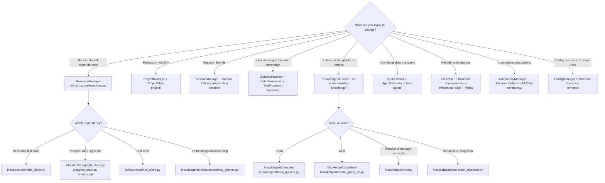
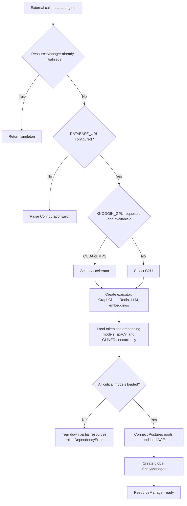
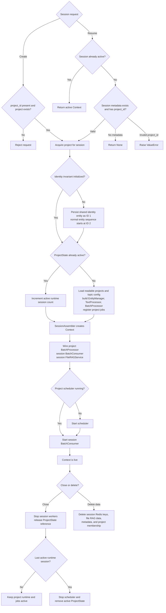
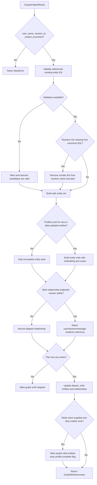
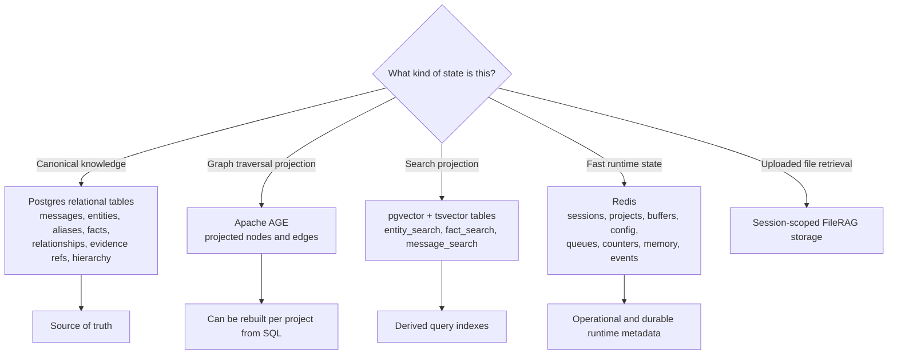
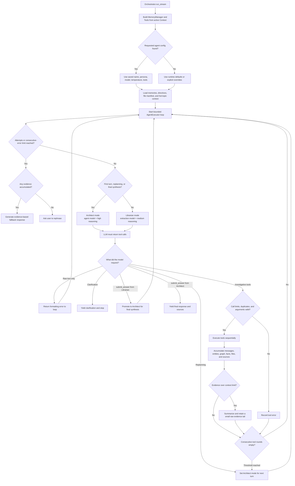
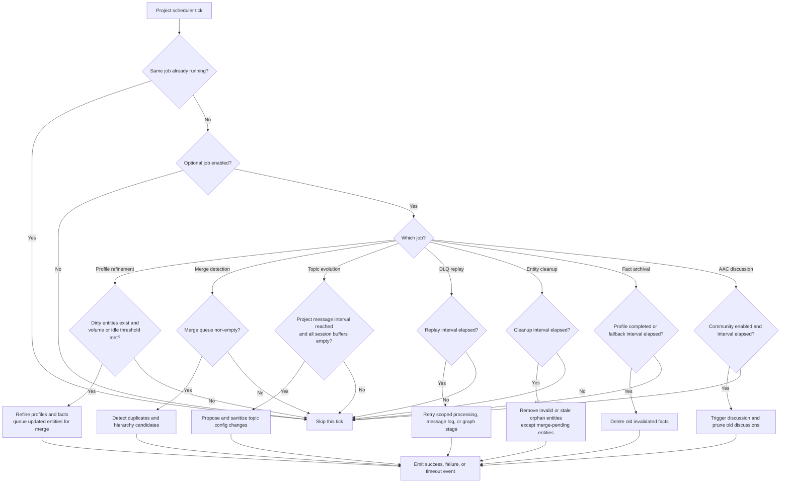
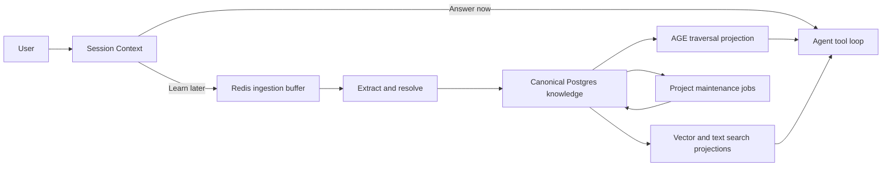

# Knoggin Server Decision Tree

This is a choose-your-own-adventure map of `knoggin-server`.

It answers two questions:

1. Where should I go in the codebase for a given kind of change?
2. What decisions does the engine make at runtime?

The server is an embeddable engine package, not an HTTP application. An external
API or SDK composes its managers and services.

## 1. Pick Your Destination

Start here when deciding which part of the codebase to inspect or change.

## 2. Engine Boot

`ResourceManager` owns expensive process-wide dependencies. Project and session
runtime objects are assembled only after those resources are ready.

## 3. Project and Session Lifecycle

The main runtime ownership rule is:

- `ResourceManager`: process-wide dependencies.
- `ProjectState`: topic config, entity resolver, ingestion processor, scheduler.
- `Context`: one active session, consumer, conversation state, and file RAG.

## 4. User Message Learning Path

The conversation loop and learning loop share the same `Context`, but ingestion
runs asynchronously through a Redis buffer.

```mermaid
flowchart TD
    MSG["Context.add(user message)"] --> DUP{"Same session + content + timestamp<br/>seen in dedup window?"}
    DUP -->|Yes| EXISTING["Return existing message ID"]
    DUP -->|No| ASSIGN["Allocate global message ID"]
    ASSIGN --> REDIS["Cache canonical message and timeline position in Redis"]
    REDIS --> BUFFER["Append scoped message to Redis ingestion buffer"]
    BUFFER --> SIGNAL["Record project activity, signal consumer, refresh TTLs"]

    SIGNAL --> WAKE{"Why did consumer wake?"}
    WAKE -->|Message signal| DRAIN["Drain up to batch_size"]
    WAKE -->|Timeout, explicit flush, or shutdown| DRAIN

    DRAIN --> VALID{"Any valid buffered messages?"}
    VALID -->|No, only corrupt entries| TRIM_BAD["Trim corrupt entries and continue"]
    VALID -->|Yes| CONTEXT["Load surrounding conversation context"]
    CONTEXT --> PROCESS["BatchProcessor.run"]

    PROCESS --> MENTIONS["Known alias matching + GLiNER"]
    MENTIONS --> LLM_NER{"LLM NER enabled?"}
    LLM_NER -->|No| DET_ONLY["Use deterministic mentions"]
    LLM_NER -->|Yes| VP01["Ask LLM for uncovered or ambiguous mentions"]
    VP01 --> LLM_OK{"LLM extraction succeeded?"}
    LLM_OK -->|No| DET_ONLY
    LLM_OK -->|Yes| FILTER["Validate confidence, topic, type, and duplicates"]
    DET_ONLY --> ACTIVE_FILTER
    FILTER --> ACTIVE_FILTER{"Mention belongs to an active topic?"}
    ACTIVE_FILTER -->|No| DROP_MENTION["Drop mention"]
    ACTIVE_FILTER -->|Yes| ANY{"Any accepted mentions?"}
    DROP_MENTION --> ANY
    ANY -->|No| NO_GRAPH["Successful batch with no graph mutations"]
    ANY -->|Yes| RESOLVE["Resolve each mention"]

    RESOLVE --> CANDIDATE{"Existing candidate above threshold<br/>and schema/context checks pass?"}
    CANDIDATE -->|Yes| REUSE["Reuse entity; optionally add alias"]
    CANDIDATE -->|No| NEW["Allocate and cache new project entity"]
    REUSE --> CONNECTIONS
    NEW --> CONNECTIONS["Extract entity and user relationships"]
    CONNECTIONS --> CONN_OK{"Connection extraction succeeded?"}
    CONN_OK -->|No| PROCESS_FAIL["Mark processing failure"]
    CONN_OK -->|Yes| RESULT["Return scoped BatchResult"]

    NO_GRAPH --> RESULT
    RESULT --> SAVE_MSG["Always persist source message logs"]
    PROCESS_FAIL --> DLQ_PROCESS["Write processing-stage DLQ entry"]
    SAVE_MSG --> MSG_OK{"Message log write succeeded?"}
    MSG_OK -->|No| DLQ_MSG["Write message-log-stage DLQ entry"]
    MSG_OK -->|Yes| HAS_WRITES{"Batch has graph writes?"}
    HAS_WRITES -->|No| CHECKPOINT["Advance checkpoint and last-processed IDs"]
    HAS_WRITES -->|Yes| WRITE["Build and execute GraphMutationPlan"]
    WRITE --> WRITE_OK{"Graph write succeeded?"}
    WRITE_OK -->|No| PURGE["Purge phantom new entities from resolver cache"]
    PURGE --> DLQ_GRAPH["Write graph-write-stage DLQ entry"]
    WRITE_OK -->|Yes| DIRTY["Mark safe entities dirty for profile refinement"]
    DIRTY --> CHECKPOINT

    DLQ_PROCESS --> DLQ_OK{"DLQ write succeeded?"}
    DLQ_MSG --> DLQ_OK
    DLQ_GRAPH --> DLQ_OK
    DLQ_OK -->|Yes| TRIM["Trim source batch from buffer"]
    DLQ_OK -->|No| RETAIN["Keep messages buffered for retry"]
    CHECKPOINT --> TRIM
```

## 5. Graph Mutation Decisions

`GraphMutationPlan` is the safety boundary between extraction and persistence.

## 6. Persistence Ownership

The storage model has a deliberate hierarchy:

Important scope decisions:

- The identity entity is always entity ID `1` in reserved scope `__identity__`.
- A normal entity belongs to a project and records its source session.
- Readable project IDs are `__identity__`, the current project, then explicitly
  allowed projects.
- Source evidence is always addressed by user, session, and message ID.
- Project jobs use project scope; live ingestion keeps the originating session
  scope.

## 7. Agent Answering Path

The agent is a bounded tool loop. The Architect plans and approves final
answers; the Librarian performs cheaper investigative steps.

Tool destinations:

| Need | Main tool path |
| --- | --- |
| Conversation evidence | `search_messages` |
| Entity profile | `search_entity` |
| Neighbors and relationships | `get_connections` |
| Time-oriented evidence | `get_recent_activity` |
| Claim verification | `fact_check` |
| Multi-hop connection | `find_path` |
| Parent or child structure | `get_hierarchy` |
| Uploaded documents | `search_files` |
| External information | `web_search`, `news_search` |
| Session memory | `save_memory`, `forget_memory` |
| AAC behavior | `save_insight`, `spawn_specialist` |

## 8. Background Job Decisions

Each active project has one scheduler. It checks jobs once at startup and every
30 seconds afterward. Enabled jobs run when either their domain trigger passes
or their declared scheduler cadence is due. The scheduler owns cadence
timestamps and advances them only after successful results; job `should_run`
checks do not mutate cadence state. Local task tracking and a token-owned Redis
lease prevent overlapping runs in the same process or across server workers.

Archival retains its profile-complete domain trigger in addition to its fallback
cadence. It consumes the profile marker with a compare-and-delete only after a
successful archival pass, so failed work and newer markers remain retryable.

## 9. The Shortest Mental Model

In one sentence: Knoggin answers from project-scoped evidence while a separate
asynchronous learning loop turns new messages into a source-grounded,
repairable knowledge index.

## Code Anchors

- [`src/infrastructure/resources.py`](../src/infrastructure/resources.py)
- [`src/knoggin_server/project/project_manager.py`](../src/knoggin_server/project/project_manager.py)
- [`src/knoggin_server/project/state.py`](../src/knoggin_server/project/state.py)
- [`src/knoggin_server/session/session_manager.py`](../src/knoggin_server/session/session_manager.py)
- [`src/knoggin_server/session/boot.py`](../src/knoggin_server/session/boot.py)
- [`src/knoggin_server/session/context.py`](../src/knoggin_server/session/context.py)
- [`src/knoggin_server/ingestion/services/batch_consumer.py`](../src/knoggin_server/ingestion/services/batch_consumer.py)
- [`src/knoggin_server/ingestion/services/pipeline_service.py`](../src/knoggin_server/ingestion/services/pipeline_service.py)
- [`src/knoggin_server/ingestion/services/processor.py`](../src/knoggin_server/ingestion/services/processor.py)
- [`src/knoggin_server/knowledge/db/write_graph_db.py`](../src/knoggin_server/knowledge/db/write_graph_db.py)
- [`src/infrastructure/graph_client.py`](../src/infrastructure/graph_client.py)
- [`src/infrastructure/schema.sql`](../src/infrastructure/schema.sql)
- [`src/knoggin_server/agent/orchestrator.py`](../src/knoggin_server/agent/orchestrator.py)
- [`src/knoggin_server/agent/executor.py`](../src/knoggin_server/agent/executor.py)
- [`src/infrastructure/job/scheduler.py`](../src/infrastructure/job/scheduler.py)
